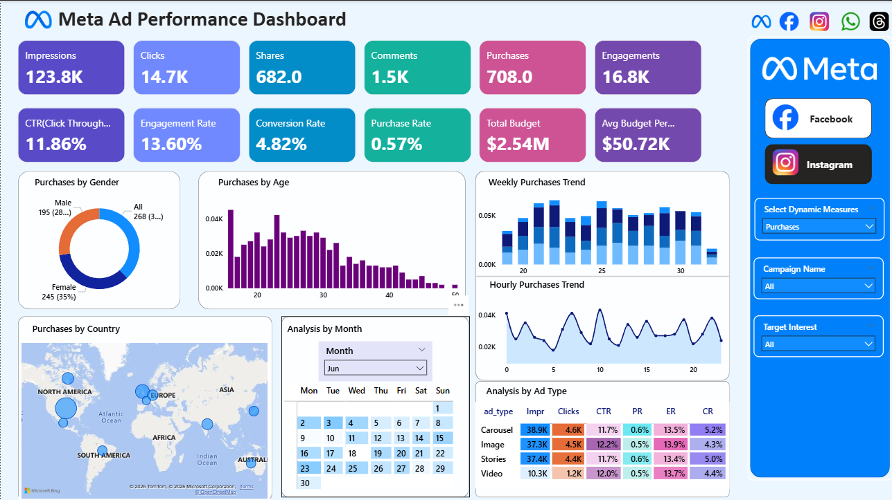
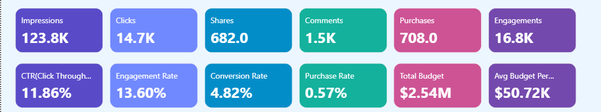
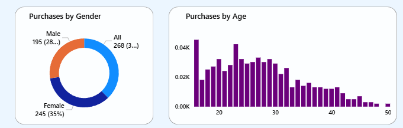
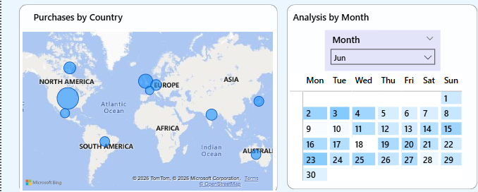
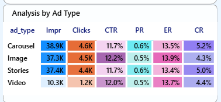
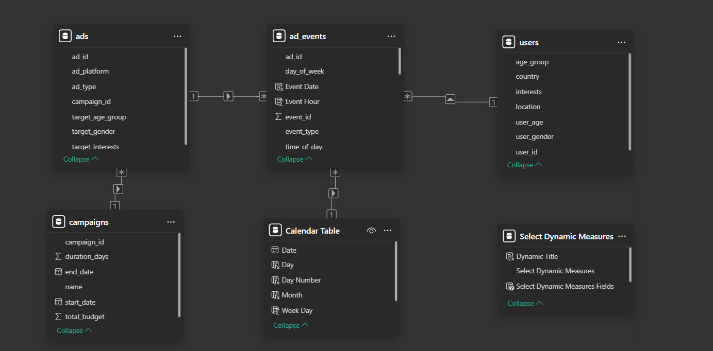

# 📊 Meta Ad Performance Analysis Dashboard

## Overview

This project presents an interactive **Power BI dashboard** developed to analyze and monitor the performance of Meta advertising campaigns. The dashboard provides insights into audience engagement, conversion efficiency, demographics, geographic distribution, and advertisement performance through KPI-driven analytics and interactive visualizations.

The solution helps marketing teams and business stakeholders understand customer behavior, optimize campaigns, improve conversions, and make data-driven decisions.

---

## Objectives

* Analyze campaign performance and effectiveness.
* Monitor user engagement and conversions.
* Identify high-performing ad formats.
* Study audience demographics and geographic trends.
* Evaluate campaign efficiency using KPI measures.
* Support strategic decisions for budget allocation and targeting.

---

## Technologies Used

* Power BI Desktop
* Power Query
* DAX
* Data Modeling
* Star Schema
* Business Intelligence
* Data Visualization

---

# Dashboard Overview

An interactive Power BI dashboard for analyzing Meta ad campaigns, audience engagement, demographics, conversion efficiency, and campaign performance.



---

# Key Performance Indicators

The dashboard tracks multiple KPIs to measure campaign effectiveness and ROI.



### KPIs Included

* Impressions
* Clicks
* Engagements
* Purchases
* Click Through Rate (CTR)
* Engagement Rate
* Conversion Rate
* Purchase Rate
* Total Budget
* Average Budget per Campaign

---

# Audience Analysis

The dashboard provides customer segmentation insights based on demographics.



### Insights

* Female users show higher engagement.
* Young adults aged 18–30 represent the primary audience.
* Audience segmentation helps improve campaign targeting and ROI.

---

# Geographic and Time-Based Analysis

Analyze regional engagement and user activity patterns over time.



### Features

#### Geographic Analysis

Top engaged countries include:

* United States
* India
* Brazil
* Germany
* United Kingdom

#### Time-Based Analysis

* Weekly engagement trends.
* Hourly engagement patterns.
* Calendar-based activity analysis.
* Peak engagement during afternoon and evening hours.

---

# Ad Type Performance Analysis

Comparison of different advertisement formats using multiple performance metrics.



### Ad Formats Analyzed

* Video Ads
* Stories Ads
* Image Ads
* Carousel Ads

### Metrics Compared

* Impressions
* Clicks
* CTR
* Purchase Rate
* Conversion Rate
* Engagement Rate

### Key Findings

* Video ads demonstrate the highest CTR and engagement.
* Story ads generate strong reach and conversions.
* Image and Carousel ads provide stable performance but slightly lower conversion efficiency.

---

# Data Model

The dashboard follows a **Star Schema** consisting of one fact table and three dimension tables.



### Fact Table

#### ad_events

Stores event-level interactions between users and advertisements.

Contains:

* Impressions
* Clicks
* Shares
* Comments
* Purchases

### Dimension Tables

#### ads

Contains metadata related to advertisements:

* Ad Platform
* Ad Type
* Target Gender
* Target Age Group
* Target Interests

#### campaigns

Stores campaign-level information:

* Campaign Name
* Campaign Duration
* Start Date
* End Date
* Budget Allocation

#### users

Stores demographic information:

* Gender
* Age
* Country
* Location
* Interests

---

# Visualizations Used

* KPI Cards
* Donut Chart
* Bar Chart
* Stacked Column Chart
* Line Chart
* Calendar Heatmap
* Matrix Table
* Interactive Slicers
* Filters

---

# Key Business Insights

## Audience Insights

* Female users contribute a higher share of engagement.
* Young adults aged 18–30 represent the most active audience.

## Geographic Insights

Major engagement originates from:

* United States
* India
* Brazil
* Germany
* United Kingdom

## Time Insights

* Engagement remains relatively stable throughout the week.
* Peak interaction occurs during afternoon and evening hours.

## Ad Format Insights

* Video advertisements demonstrate the strongest performance.
* Story ads also generate high engagement and impressions.
* Image and Carousel ads show slightly lower conversion rates.

---

# Recommendations

* Improve landing pages and conversion funnels.
* Allocate additional budget to Video and Story advertisements.
* Focus campaigns on highly engaged regions.
* Target younger audiences for better ROI.
* Schedule advertisements during peak engagement hours.
* Implement retargeting strategies to increase conversions.

---

# Folder Structure

```text
Meta_Ad_Performance_Dashboard
│
├── Meta_Ad.pbix
├── README.md
│
├── Images
│   ├── dashboard_overview.png
│   ├── kpi_cards.png
│   ├── audience_analysis.png
│   ├── time_geographic_analysis.png
│   ├── ad_type_performance.png
│   └── data_model.png
|
├── Data
│   ├── ad_events.csv
│   ├── ads.csv
│   ├── campaigns.csv
│   ├── users.csv
```

---

# Future Enhancements

* Integration with live Meta Ads API.
* Automated refresh schedules.
* Advanced DAX measures.
* ROI and ROAS optimization dashboards.
* Predictive campaign performance analysis.
* Customer segmentation and cohort analysis.

---

# Author

**Harijith M. M.**
